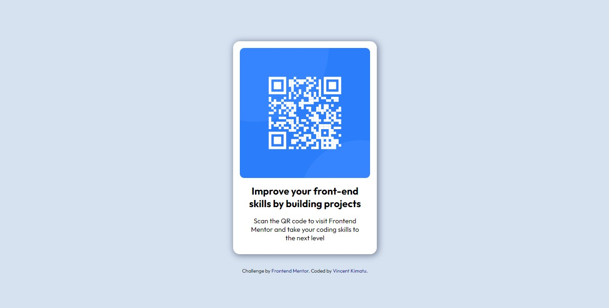

## QR code component

A perfect first challenge for beginners in HTML and CSS. The card layout doesn't shift, so it's ideal if beginners who haven't learned about building responsive layouts yet.

## [Live site](https://vincent-qr-code-component-challenge.netlify.app/)

QR code component
: Built with `html` and `css`

## Screenshots

### desktop preview

  

### mobile preview

  

